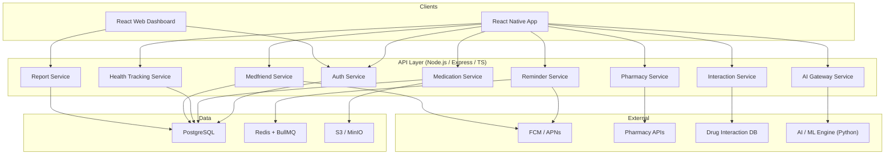

# Step 00 – Project Overview & Architecture

## 1. Vision

**MedReminder** is a full-featured medication management platform inspired by MediSafe.
It helps users track medications, receive intelligent reminders, monitor health
measurements, share schedules with caregivers, and detect drug interactions —
enhanced with AI-powered features throughout.

---

## 2. Core Feature Map (derived from MediSafe analysis)

| # | Feature Area | Free | Premium |
|---|---|---|---|
| 1 | Medication CRUD (name, dosage, schedule, photo, shape/color) | ✅ (limit 10) | ✅ unlimited |
| 2 | Customisable reminders (per-med times, snooze, confirm, skip) | ✅ | ✅ |
| 3 | Complex schedules (every X days, specific weekdays, cycles, as-needed) | ✅ | ✅ |
| 4 | Refill reminders (pills remaining countdown) | ✅ | ✅ |
| 5 | Doctor appointment reminders + calendar sync | ✅ | ✅ |
| 6 | Drug-drug interaction checker (minor → severe scale) | ✅ | ✅ |
| 7 | Medfriend / caregiver notifications on missed doses | ✅ (1 friend) | ✅ unlimited |
| 8 | Family profiles (manage meds for dependents) | ✅ (1 profile) | ✅ unlimited |
| 9 | Health measurement tracking (BP, glucose, weight, mood, 25+ metrics) | ✅ (3 metrics) | ✅ unlimited |
| 10 | Adherence history & reports (daily / weekly / monthly) | ✅ basic | ✅ full + export |
| 11 | Dashboard for patients and optional provider view | – | ✅ |
| 12 | Pharmacy import / prescription integration | ✅ | ✅ |
| 13 | AI: JITI – Just-In-Time Intervention (smart nudges) | – | ✅ |
| 14 | AI: Predictive adherence scoring | – | ✅ |
| 15 | AI: Natural-language drug info chatbot | – | ✅ |
| 16 | Medication delivery (partner pharmacy) | – | ✅ |
| 17 | Weekend mode (silence reminders) | ✅ | ✅ |
| 18 | Offline-first (local notifications w/o internet) | ✅ | ✅ |
| 19 | Theming & customisation | basic | ✅ full |
| 20 | Ad-free experience | – | ✅ |

---

## 3. Recommended Tech Stack

```
┌──────────────────────────────────────────────────────────┐
│                      CLIENTS                             │
│  React Native (Expo)  ·  React Web (admin/dashboard)     │
└──────────────┬───────────────────────────┬───────────────┘
               │  REST / GraphQL           │
┌──────────────▼───────────────────────────▼───────────────┐
│                  API GATEWAY (Express.js)                 │
│        Node.js  ·  TypeScript  ·  JWT Auth                │
└────┬─────────┬─────────┬─────────┬──────────┬───────────┘
     │         │         │         │          │
┌────▼───┐ ┌───▼────┐ ┌──▼──┐ ┌───▼───┐ ┌────▼────┐
│Postgres│ │ Redis  │ │ S3  │ │ FCM / │ │  AI /   │
│  (DB)  │ │(cache/ │ │(img)│ │ APNs  │ │ ML svc  │
│        │ │ queue) │ │     │ │       │ │(Python) │
└────────┘ └────────┘ └─────┘ └───────┘ └─────────┘
```

| Layer | Technology | Rationale |
|---|---|---|
| **Mobile** | React Native + Expo | Cross-platform (iOS & Android), shared codebase |
| **Web dashboard** | React + Vite | Admin / provider portal, reports |
| **Backend API** | Node.js, Express, TypeScript | Event-driven, real-time, healthcare ecosystem support |
| **ORM** | Prisma | Type-safe DB access, migrations, introspection |
| **Database** | PostgreSQL 16 | ACID, JSONB, row-level security |
| **Cache / Queue** | Redis + BullMQ | Scheduled jobs (reminders), caching |
| **Push notifications** | Firebase Cloud Messaging (FCM) + APNs | Native push on both platforms |
| **File storage** | S3-compatible (MinIO locally) | Med photos, report PDFs |
| **AI / ML** | Python micro-service (FastAPI) | Drug interaction engine, JITI model, chatbot |
| **Containerisation** | Docker + Docker Compose | Consistent dev & prod environments |
| **CI/CD** | GitHub Actions | Lint, test, build, deploy pipeline |
| **Monitoring** | Prometheus + Grafana | Health checks, uptime, performance |

---

## 4. High-Level Architecture Diagram



---

## 5. Design Principles

| Principle | Application |
|---|---|
| **SOLID** | Each service has a single responsibility; depend on abstractions (interfaces) not concretions |
| **DRY** | Shared validation schemas (Zod), utility libraries, shared types package |
| **Repository Pattern** | Data access abstracted behind repository interfaces (easy to swap DB) |
| **Service Layer Pattern** | Business logic separated from controllers and data access |
| **Strategy Pattern** | Notification delivery (FCM / APNs / email / SMS) behind a common interface |
| **Observer Pattern** | Event emitter for dose-taken / dose-missed events triggering side-effects |
| **Factory Pattern** | Schedule builder for complex dosing regimens |
| **Offline-first** | Local SQLite cache + background sync for mobile |

---

## 6. Monorepo Structure (Proposed)

```
MedReminder/
├── apps/
│   ├── mobile/           # React Native (Expo) app
│   └── web/              # React Vite dashboard
├── packages/
│   ├── shared-types/     # TypeScript interfaces & Zod schemas
│   ├── ui-kit/           # Shared component library
│   └── utils/            # Common utility functions
├── services/
│   ├── api/              # Node.js/Express backend
│   │   ├── src/
│   │   │   ├── modules/  # Feature modules (med, reminder, etc.)
│   │   │   ├── common/   # Shared middleware, guards, decorators
│   │   │   └── config/   # Environment & app config
│   │   ├── prisma/       # Schema & migrations
│   │   └── tests/
│   └── ai-engine/        # Python FastAPI micro-service
│       ├── app/
│       │   ├── routers/
│       │   ├── models/
│       │   └── services/
│       └── tests/
├── infra/
│   ├── docker/           # Dockerfiles per service
│   ├── docker-compose.yml
│   ├── nginx/            # Reverse proxy config
│   └── scripts/          # DB seed, migration helpers
├── .github/
│   └── workflows/        # CI/CD pipelines
├── plan/                 # ← You are here (planning docs)
├── .gitignore
├── package.json          # Workspace root (npm workspaces)
└── README.md
```

---

## 7. Step-by-Step Implementation Order

| Step | Document | Focus |
|---|---|---|
| 00 | This file | Overview & architecture |
| 01 | `01-environment-setup.md` | Git, Docker, monorepo scaffold, dev tools |
| 02 | `02-database-design.md` | PostgreSQL schema, Prisma models, seed data |
| 03 | `03-backend-api-foundation.md` | Express setup, middleware, error handling, logging |
| 04 | `04-authentication.md` | JWT auth, refresh tokens, RBAC, OAuth social login |
| 05 | `05-medication-management.md` | Med CRUD, schedule builder, photo upload |
| 06 | `06-reminders-notifications.md` | BullMQ scheduler, FCM/APNs, offline local notifications |
| 07 | `07-drug-interactions.md` | Interaction database, severity engine, alerts |
| 08 | `08-health-tracking.md` | Measurements CRUD, charting, Apple Health / Google Fit sync |
| 09 | `09-medfriend-caregivers.md` | Invitation flow, shared schedules, missed-dose alerts |
| 10 | `10-pharmacy-integration.md` | Prescription import, refill ordering, pharmacy partner API |
| 11 | `11-ai-features.md` | JITI interventions, adherence prediction, drug chatbot |
| 12 | `12-dashboard-reporting.md` | Patient dashboard, provider portal, PDF export |
| 13 | `13-frontend-foundation.md` | Expo setup, navigation, theming, design system |
| 14 | `14-frontend-screens.md` | All feature screens, UX flows, accessibility |
| 15 | `15-premium-payments.md` | Stripe/IAP, subscription management, feature gating |
| 16 | `16-security-testing.md` | Encryption, HIPAA/GDPR, unit/integration/E2E tests |
| 17 | `17-deployment-cicd.md` | Production Docker, GitHub Actions, monitoring |

> **Next →** [Step 01 – Environment Setup](./01-environment-setup.md)
