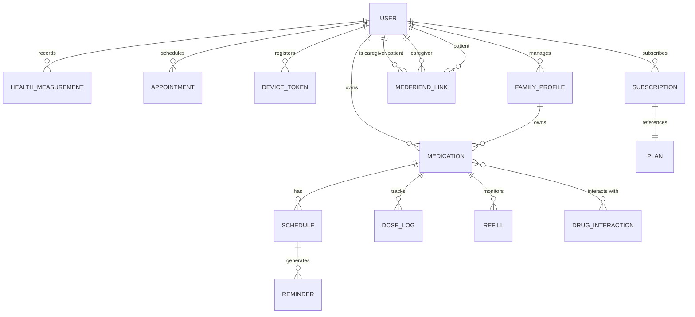

# Step 02 – Database Design

## Goals
- Design a normalised PostgreSQL schema covering all feature areas
- Define Prisma models with relations, indexes, and constraints
- Plan seed data and migration strategy

---

## 1. Entity-Relationship Overview



---

## 2. Core Tables

### `users`
| Column | Type | Notes |
|---|---|---|
| id | UUID (PK) | `gen_random_uuid()` |
| email | VARCHAR(255) | unique, indexed |
| password_hash | VARCHAR(255) | bcrypt |
| first_name | VARCHAR(100) | |
| last_name | VARCHAR(100) | |
| avatar_url | TEXT | nullable |
| timezone | VARCHAR(50) | e.g. `America/New_York` |
| locale | VARCHAR(10) | e.g. `en-US` |
| role | ENUM | `patient`, `caregiver`, `provider`, `admin` |
| is_premium | BOOLEAN | default `false` |
| weekend_mode | BOOLEAN | default `false` |
| created_at | TIMESTAMPTZ | |
| updated_at | TIMESTAMPTZ | |

### `family_profiles`
| Column | Type | Notes |
|---|---|---|
| id | UUID (PK) | |
| owner_id | UUID (FK → users) | |
| name | VARCHAR(100) | e.g. "Mom", "Son" |
| relationship | VARCHAR(50) | |
| avatar_url | TEXT | nullable |
| date_of_birth | DATE | nullable |
| created_at | TIMESTAMPTZ | |

### `medications`
| Column | Type | Notes |
|---|---|---|
| id | UUID (PK) | |
| user_id | UUID (FK → users) | |
| family_profile_id | UUID (FK) | nullable (null = self) |
| name | VARCHAR(255) | indexed |
| generic_name | VARCHAR(255) | nullable |
| dosage | VARCHAR(100) | e.g. "500mg" |
| form | ENUM | `pill`, `capsule`, `liquid`, `injection`, `patch`, `inhaler`, `drops`, `cream`, `other` |
| shape | VARCHAR(50) | nullable (visual ID) |
| color | VARCHAR(50) | nullable (visual ID) |
| photo_url | TEXT | nullable |
| instructions | TEXT | nullable (e.g. "take with food") |
| quantity_total | INTEGER | pills in bottle |
| quantity_remaining | INTEGER | countdown for refill |
| refill_threshold | INTEGER | alert when remaining ≤ this |
| is_as_needed | BOOLEAN | default `false` |
| rx_number | VARCHAR(100) | nullable (prescription #) |
| prescriber | VARCHAR(255) | nullable |
| pharmacy_id | UUID (FK) | nullable |
| is_active | BOOLEAN | default `true` |
| start_date | DATE | |
| end_date | DATE | nullable |
| created_at | TIMESTAMPTZ | |
| updated_at | TIMESTAMPTZ | |

### `schedules`
| Column | Type | Notes |
|---|---|---|
| id | UUID (PK) | |
| medication_id | UUID (FK) | |
| schedule_type | ENUM | `daily`, `specific_days`, `interval`, `cycle` |
| times_per_day | INTEGER | |
| time_slots | JSONB | `["08:00","14:00","20:00"]` |
| days_of_week | INTEGER[] | `[1,3,5]` (Mon,Wed,Fri) |
| interval_days | INTEGER | nullable (every X days) |
| cycle_days_on | INTEGER | nullable |
| cycle_days_off | INTEGER | nullable |
| created_at | TIMESTAMPTZ | |

### `dose_logs`
| Column | Type | Notes |
|---|---|---|
| id | UUID (PK) | |
| medication_id | UUID (FK) | |
| user_id | UUID (FK) | |
| scheduled_time | TIMESTAMPTZ | when it was supposed to be taken |
| action | ENUM | `taken`, `skipped`, `missed`, `snoozed` |
| action_time | TIMESTAMPTZ | when user responded |
| notes | TEXT | nullable |
| created_at | TIMESTAMPTZ | |

### `reminders`
| Column | Type | Notes |
|---|---|---|
| id | UUID (PK) | |
| schedule_id | UUID (FK) | |
| user_id | UUID (FK) | |
| fire_at | TIMESTAMPTZ | scheduled notification time |
| status | ENUM | `pending`, `sent`, `acknowledged`, `snoozed`, `failed` |
| snooze_until | TIMESTAMPTZ | nullable |
| attempts | INTEGER | default 0 |
| created_at | TIMESTAMPTZ | |

### `drug_interactions`
| Column | Type | Notes |
|---|---|---|
| id | UUID (PK) | |
| drug_a_rxcui | VARCHAR(20) | RxNorm concept ID |
| drug_b_rxcui | VARCHAR(20) | |
| severity | ENUM | `minor`, `moderate`, `major`, `severe` |
| description | TEXT | |
| recommendation | TEXT | |
| source | VARCHAR(100) | e.g. "FDA", "DrugBank" |

### `health_measurements`
| Column | Type | Notes |
|---|---|---|
| id | UUID (PK) | |
| user_id | UUID (FK) | |
| metric_type | VARCHAR(50) | `blood_pressure`, `glucose`, `weight`, etc. |
| value | DECIMAL | primary value |
| value_secondary | DECIMAL | nullable (e.g. diastolic BP) |
| unit | VARCHAR(20) | `mg/dL`, `mmHg`, `kg`, etc. |
| measured_at | TIMESTAMPTZ | |
| notes | TEXT | nullable |
| source | VARCHAR(50) | `manual`, `apple_health`, `google_fit` |
| created_at | TIMESTAMPTZ | |

### `medfriend_links`
| Column | Type | Notes |
|---|---|---|
| id | UUID (PK) | |
| patient_id | UUID (FK → users) | |
| caregiver_id | UUID (FK → users) | nullable (pending invite) |
| invite_email | VARCHAR(255) | |
| invite_token | VARCHAR(255) | |
| status | ENUM | `pending`, `accepted`, `declined`, `revoked` |
| permissions | JSONB | `{"view_meds": true, "view_health": false}` |
| notify_on_miss | BOOLEAN | default `true` |
| created_at | TIMESTAMPTZ | |

### `appointments`
| Column | Type | Notes |
|---|---|---|
| id | UUID (PK) | |
| user_id | UUID (FK) | |
| title | VARCHAR(255) | |
| doctor_name | VARCHAR(255) | nullable |
| location | TEXT | nullable |
| appointment_at | TIMESTAMPTZ | |
| reminder_minutes_before | INTEGER | default 60 |
| notes | TEXT | nullable |
| created_at | TIMESTAMPTZ | |

### `pharmacies`
| Column | Type | Notes |
|---|---|---|
| id | UUID (PK) | |
| name | VARCHAR(255) | |
| address | TEXT | |
| phone | VARCHAR(20) | |
| api_partner_id | VARCHAR(100) | nullable |
| supports_delivery | BOOLEAN | default `false` |

### `refills`
| Column | Type | Notes |
|---|---|---|
| id | UUID (PK) | |
| medication_id | UUID (FK) | |
| pharmacy_id | UUID (FK) | nullable |
| status | ENUM | `pending`, `ordered`, `ready`, `picked_up`, `delivered` |
| requested_at | TIMESTAMPTZ | |
| fulfilled_at | TIMESTAMPTZ | nullable |

### `device_tokens`
| Column | Type | Notes |
|---|---|---|
| id | UUID (PK) | |
| user_id | UUID (FK) | |
| token | TEXT | FCM / APNs token |
| platform | ENUM | `ios`, `android`, `web` |
| is_active | BOOLEAN | default `true` |
| created_at | TIMESTAMPTZ | |

### `subscriptions`
| Column | Type | Notes |
|---|---|---|
| id | UUID (PK) | |
| user_id | UUID (FK) | |
| plan_id | UUID (FK) | |
| provider | ENUM | `stripe`, `apple_iap`, `google_play` |
| provider_subscription_id | VARCHAR(255) | |
| status | ENUM | `active`, `cancelled`, `past_due`, `expired` |
| current_period_start | TIMESTAMPTZ | |
| current_period_end | TIMESTAMPTZ | |
| created_at | TIMESTAMPTZ | |

### `plans`
| Column | Type | Notes |
|---|---|---|
| id | UUID (PK) | |
| name | VARCHAR(100) | `free`, `premium_monthly`, `premium_yearly` |
| price_cents | INTEGER | |
| interval | ENUM | `month`, `year` |
| features | JSONB | feature flags |

### `ai_interventions` (JITI logs)
| Column | Type | Notes |
|---|---|---|
| id | UUID (PK) | |
| user_id | UUID (FK) | |
| type | VARCHAR(50) | `nudge`, `encouragement`, `education`, `alert` |
| content | TEXT | message shown to user |
| trigger_reason | TEXT | why AI fired this |
| was_effective | BOOLEAN | nullable (did user take dose after?) |
| delivered_at | TIMESTAMPTZ | |

### `audit_logs`
| Column | Type | Notes |
|---|---|---|
| id | UUID (PK) | |
| user_id | UUID (FK) | |
| action | VARCHAR(100) | e.g. `medication.created` |
| entity_type | VARCHAR(50) | |
| entity_id | UUID | |
| changes | JSONB | before/after diff |
| ip_address | INET | |
| created_at | TIMESTAMPTZ | |

---

## 3. Indexes

```sql
-- High-frequency queries
CREATE INDEX idx_medications_user    ON medications (user_id, is_active);
CREATE INDEX idx_dose_logs_user_time ON dose_logs (user_id, scheduled_time DESC);
CREATE INDEX idx_reminders_fire      ON reminders (fire_at, status) WHERE status = 'pending';
CREATE INDEX idx_health_user_type    ON health_measurements (user_id, metric_type, measured_at DESC);
CREATE INDEX idx_interactions_drugs  ON drug_interactions (drug_a_rxcui, drug_b_rxcui);
CREATE INDEX idx_audit_entity        ON audit_logs (entity_type, entity_id);
```

---

## 4. Migration Strategy

1. Use Prisma Migrate for all schema changes
2. Each migration gets a descriptive name: `npx prisma migrate dev --name add_health_measurements`
3. Seed script (`prisma/seed.ts`) populates:
   - Default plans (free, premium)
   - Sample drug interactions (top 100 common pairs)
   - Demo user with sample medications

---

> **Next →** [Step 03 – Backend API Foundation](./03-backend-api-foundation.md)
