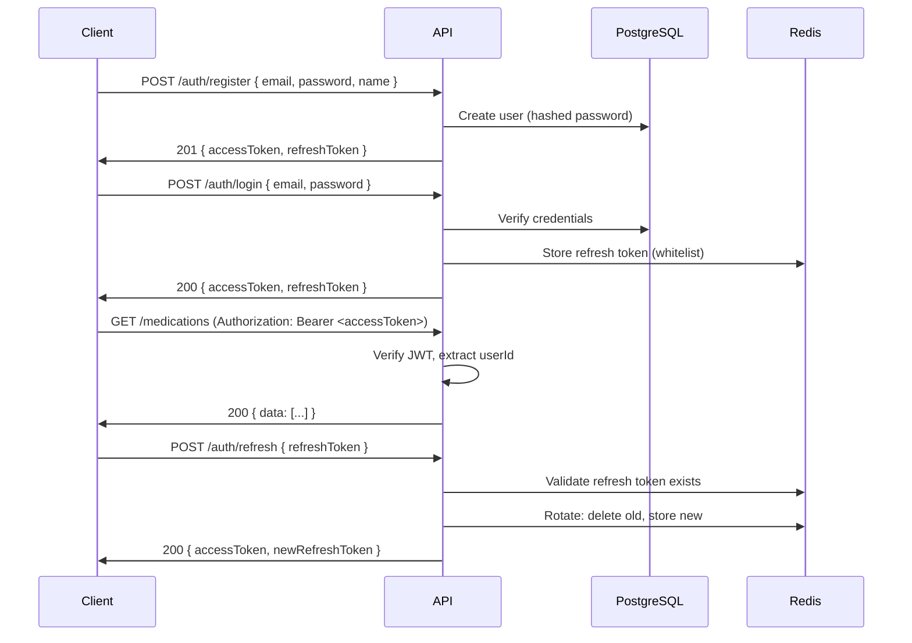

# Step 04 – Authentication & Authorization

## Goals
- Implement JWT-based authentication with refresh tokens
- Add social OAuth login (Google, Apple)
- Role-based access control (RBAC)
- Biometric auth support on mobile

---

## 1. Auth Flow



---

## 2. Token Strategy

| Token | TTL | Storage |
|---|---|---|
| Access token | 15 minutes | Client memory / secure storage |
| Refresh token | 30 days | Redis whitelist + `httpOnly` cookie (web) |

### JWT Payload
```typescript
{
  sub: "user-uuid",
  email: "user@example.com",
  role: "patient",
  isPremium: false,
  iat: 1707782400,
  exp: 1707783300
}
```

---

## 3. API Endpoints

| Method | Path | Description | Auth |
|---|---|---|---|
| POST | `/auth/register` | Create account | No |
| POST | `/auth/login` | Email/password login | No |
| POST | `/auth/refresh` | Refresh access token | Refresh token |
| POST | `/auth/logout` | Invalidate refresh token | Yes |
| POST | `/auth/forgot-password` | Send reset email | No |
| POST | `/auth/reset-password` | Set new password | Reset token |
| POST | `/auth/verify-email` | Email verification | Verify token |
| GET  | `/auth/me` | Current user profile | Yes |
| PATCH| `/auth/me` | Update profile | Yes |
| POST | `/auth/oauth/google` | Google OAuth | No |
| POST | `/auth/oauth/apple` | Apple Sign In | No |

---

## 4. Password Policy

- Minimum 8 characters
- At least 1 uppercase, 1 lowercase, 1 digit
- Bcrypt with cost factor 12
- Zod schema validation on registration

---

## 5. RBAC (Role-Based Access Control)

| Role | Capabilities |
|---|---|
| `patient` | Manage own meds, health data, medfriends |
| `caregiver` | View linked patient's meds & adherence |
| `provider` | View linked patients' dashboards & reports |
| `admin` | Full system access, user management |

### Middleware
```typescript
// Usage in route:
router.get('/admin/users',
  authMiddleware,                    // must be logged in
  rbacMiddleware(['admin']),         // must have admin role
  userController.listAll
);
```

---

## 6. OAuth Social Login

### Google
- Use `@react-native-google-signin/google-signin` on mobile
- Backend verifies Google ID token via Google's tokeninfo endpoint
- Create/link user account, issue JWT pair

### Apple Sign In
- Use `@invertase/react-native-apple-authentication`
- Backend verifies Apple identity token
- Handle "Hide My Email" relay addresses

---

## 7. Security Measures

| Measure | Implementation |
|---|---|
| Brute-force protection | Rate limit `/auth/login` to 5 attempts / 15 min per IP |
| Token rotation | New refresh token on each refresh; old one invalidated |
| Token blacklist | Redis set of revoked access tokens (on logout) |
| CSRF protection | SameSite cookies + CSRF token for web |
| Account lockout | After 10 failed attempts, lock for 30 minutes |
| Audit trail | Log all auth events to `audit_logs` table |

---

> **Next →** [Step 05 – Medication Management](./05-medication-management.md)
