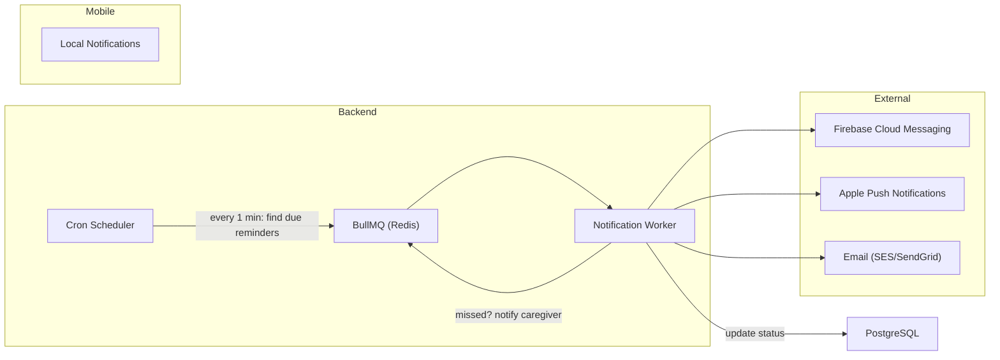

# Step 06 – Reminder & Notification System

## Goals
- Reliable, time-zone-aware reminder scheduling
- Multi-channel delivery (push, email, SMS)
- Snooze, escalation, and caregiver fallback
- Offline-first local notifications on mobile
- Weekend mode support

---

## 1. Architecture



---

## 2. Reminder Generation

### Nightly batch job (runs at 00:05 UTC)
1. For each active medication schedule, generate `reminders` rows for the **next 48 hours**
2. Convert user's local schedule times to UTC using their stored timezone
3. Insert with `status = 'pending'`

### Real-time scheduler (runs every 60 seconds)
1. Query: `SELECT * FROM reminders WHERE fire_at <= NOW() AND status = 'pending'`
2. Add each to BullMQ queue with `delay = 0`
3. Mark as `status = 'sent'`

---

## 3. Notification Delivery (Strategy Pattern)

```typescript
interface INotificationChannel {
  send(recipient: NotificationTarget, payload: NotificationPayload): Promise<void>;
}

class FCMChannel implements INotificationChannel { /* ... */ }
class APNsChannel implements INotificationChannel { /* ... */ }
class EmailChannel implements INotificationChannel { /* ... */ }
class SMSChannel implements INotificationChannel { /* ... */ }

class NotificationDispatcher {
  constructor(private channels: INotificationChannel[]) {}

  async dispatch(target: NotificationTarget, payload: NotificationPayload) {
    // Send via all registered channels for this user
  }
}
```

---

## 4. Notification Payload

```json
{
  "title": "Time for Metformin 💊",
  "body": "500mg — Take with food",
  "data": {
    "type": "medication_reminder",
    "medicationId": "uuid",
    "scheduledTime": "2025-02-12T20:00:00Z",
    "actions": ["take", "skip", "snooze"]
  }
}
```

### Actionable notifications (interactive)
- **Take** → POST `/medications/:id/take`
- **Skip** → POST `/medications/:id/skip`
- **Snooze 15min** → PATCH `/reminders/:id/snooze` → re-queue with 15min delay

---

## 5. Escalation Flow

```
T+0 min:   Push notification sent
T+5 min:   If no response → second push ("Don't forget your Metformin!")
T+15 min:  If still no response → mark as MISSED
T+15 min:  If Medfriend linked → notify caregiver
T+30 min:  If AI JITI enabled → trigger AI intervention nudge
```

### Escalation managed via BullMQ delayed jobs:
```typescript
await reminderQueue.add('check-response', { reminderId }, {
  delay: 5 * 60 * 1000,  // 5 minutes
  jobId: `escalation-${reminderId}`,
});
```
If user responds before the job fires → remove the delayed job.

---

## 6. Weekend Mode

- When `user.weekend_mode = true`:
  - Saturday & Sunday reminders are suppressed
  - Reminders still logged as `status = 'suppressed'` for reporting
  - No caregiver notifications during weekend mode

---

## 7. Offline Local Notifications (Mobile)

Using `expo-notifications`:
1. On each sync, download next 48h of medication schedules
2. Register **local** notifications using `Notifications.scheduleNotificationAsync()`
3. These fire even without internet
4. On next sync, reconcile local state with server

```typescript
await Notifications.scheduleNotificationAsync({
  content: {
    title: 'Time for Metformin 💊',
    body: '500mg — Take with food',
    data: { medicationId, scheduledTime },
  },
  trigger: { date: new Date(scheduledTime) },
});
```

---

## 8. Appointment Reminders

- Same notification infrastructure
- `reminder_minutes_before` configurable (default 60 min)
- Option to add to device calendar via `expo-calendar`

---

> **Next →** [Step 07 – Drug Interactions](./07-drug-interactions.md)
