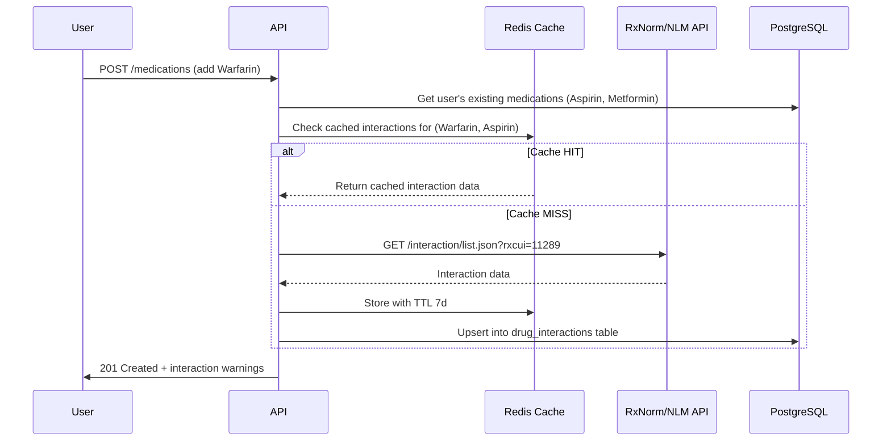

# Step 07 – Drug Interaction Engine

## Goals
- Detect drug-drug interactions when medications are added
- Severity classification (minor → severe)
- Real-time alerts and detailed info screens
- Leverage public APIs + local cache for speed

---

## 1. Interaction Check Flow



---

## 2. Data Sources

| Source | URL | Use |
|---|---|---|
| **RxNorm API** | `rxnav.nlm.nih.gov/REST/rxcui.json` | Map drug name → RxCUI |
| **NLM Interaction API** | `rxnav.nlm.nih.gov/REST/interaction/list.json` | Get interactions by RxCUI |
| **OpenFDA** | `api.fda.gov/drug/event.json` | Adverse event data (enrichment) |
| **Local DB** | `drug_interactions` table | Cached interactions + curated overrides |

---

## 3. Severity Scale

| Level | Color | User Action |
|---|---|---|
| **Minor** | 🟡 Yellow | Informational — no immediate action |
| **Moderate** | 🟠 Orange | "Discuss with your doctor" |
| **Major** | 🔴 Red | Strong warning — "Contact your doctor before taking together" |
| **Severe** | ⛔ Red + alert | Blocking alert — "Do NOT take together without medical approval" |

---

## 4. API Endpoints

| Method | Path | Description |
|---|---|---|
| GET | `/interactions/check?medIds=uuid1,uuid2` | Check interactions between specific medications |
| GET | `/interactions/my-medications` | Check all interactions across user's active meds |
| GET | `/interactions/:interactionId` | Detailed interaction info |
| GET | `/medications/:id/interactions` | Interactions for a specific medication |

---

## 5. Response Format

```json
{
  "success": true,
  "data": {
    "interactions": [
      {
        "id": "uuid",
        "drugA": { "name": "Warfarin", "rxcui": "11289" },
        "drugB": { "name": "Aspirin", "rxcui": "1191" },
        "severity": "major",
        "description": "Concurrent use increases the risk of bleeding.",
        "recommendation": "Monitor INR closely. Discuss with your physician.",
        "source": "NLM"
      }
    ],
    "summary": {
      "total": 1,
      "severe": 0,
      "major": 1,
      "moderate": 0,
      "minor": 0
    }
  }
}
```

---

## 6. Interaction with Food & Lifestyle (AI enhanced)

Beyond drug-drug, flag common drug-food interactions:
- **Warfarin + Vitamin K-rich foods** (leafy greens)
- **Statins + Grapefruit**
- **MAOIs + Tyramine** (aged cheese, wine)
- **Metformin + Alcohol**

These are stored as a separate `drug_lifestyle_interactions` reference table and surfaced on the medication info screen.

---

## 7. Background Re-scan

When user's medication list changes:
1. Trigger a full interaction re-scan
2. Compare against previous scan results
3. Notify user of any **new** interactions

---

> **Next →** [Step 08 – Health Tracking](./08-health-tracking.md)
