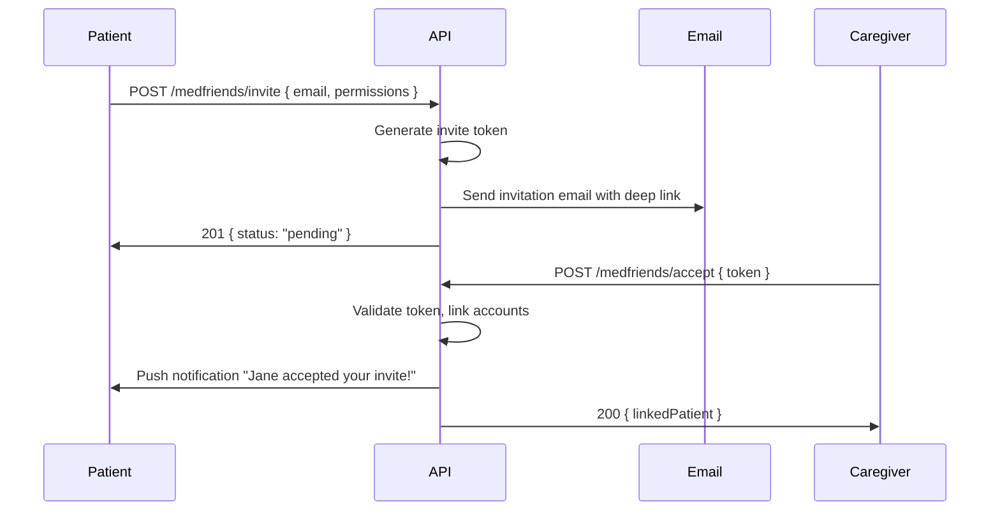

# Step 09 – Medfriend / Caregiver System

## Goals
- Invite family/friends to monitor medication adherence
- Granular permission control
- Missed-dose caregiver notifications
- Family profile management for dependents

---

## 1. Invitation Flow



---

## 2. API Endpoints

| Method | Path | Description |
|---|---|---|
| POST | `/medfriends/invite` | Invite caregiver by email |
| POST | `/medfriends/accept` | Accept invitation |
| POST | `/medfriends/decline` | Decline invitation |
| GET  | `/medfriends` | List all linked caregivers/patients |
| PATCH | `/medfriends/:id/permissions` | Update permissions |
| DELETE | `/medfriends/:id` | Revoke link |
| GET | `/medfriends/:id/medications` | View linked patient's medications (caregiver) |
| GET | `/medfriends/:id/adherence` | View linked patient's adherence stats (caregiver) |

---

## 3. Permission Model

```typescript
interface MedfriendPermissions {
  viewMedications: boolean;    // See medication list
  viewSchedule: boolean;       // See dosing schedule
  viewAdherence: boolean;      // See taken/missed/skipped logs
  viewHealth: boolean;         // See health measurements
  receiveAlerts: boolean;      // Get notified on missed doses
  canEditMedications: boolean; // Manage patient's meds (family member)
}
```

### Default permissions on invite:
```json
{
  "viewMedications": true,
  "viewSchedule": true,
  "viewAdherence": true,
  "viewHealth": false,
  "receiveAlerts": true,
  "canEditMedications": false
}
```

---

## 4. Missed-Dose Caregiver Alert

Triggered by the escalation flow (Step 06):

1. Dose marked as `missed` after 15-minute timeout
2. System checks all `medfriend_links` for this patient where `notify_on_miss = true`
3. Send push notification to each caregiver:
   ```
   "Mom missed her 2pm Metformin dose"
   ```
4. Log alert in `ai_interventions` table for analytics

---

## 5. Family Profiles

Users can manage medications for dependents (children, elderly parents):

| Method | Path | Description |
|---|---|---|
| POST | `/family-profiles` | Create dependent profile |
| GET | `/family-profiles` | List all profiles |
| PATCH | `/family-profiles/:id` | Update profile |
| DELETE | `/family-profiles/:id` | Remove profile |

- Medications linked to a family profile via `medication.family_profile_id`
- Dose logging and reminders work identically
- Dashboard shows separate adherence per profile

### Premium Gating
| Feature | Free | Premium |
|---|---|---|
| Medfriends | 1 | Unlimited |
| Family profiles | 1 | Unlimited |

---

> **Next →** [Step 10 – Pharmacy Integration](./10-pharmacy-integration.md)
