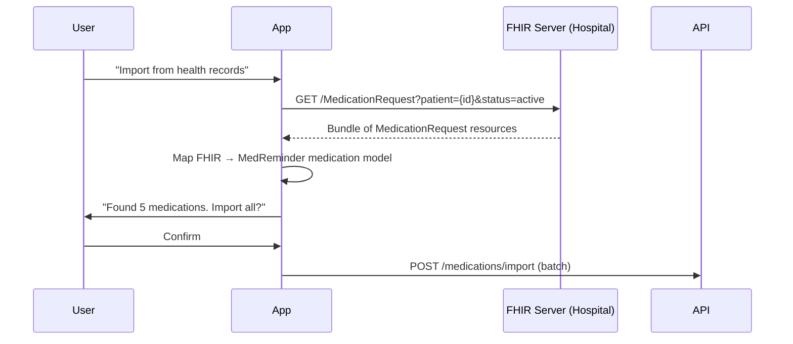
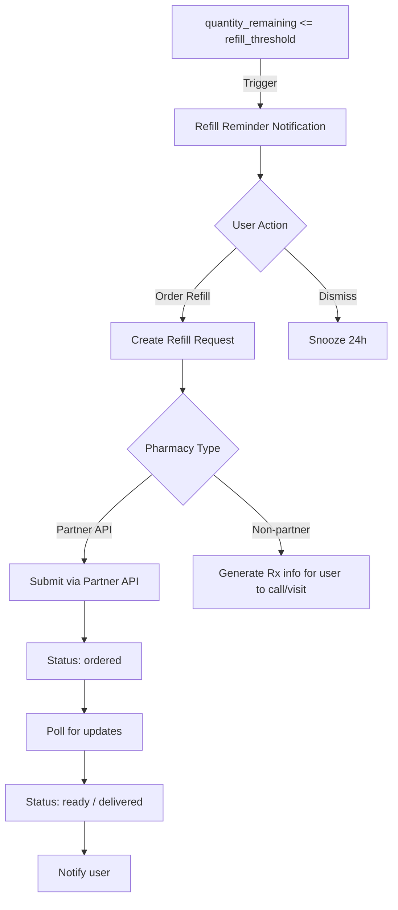

# Step 10 – Pharmacy Integration

## Goals
- Import prescriptions from pharmacy records
- Automated refill ordering
- Pharmacy locator
- Partner pharmacy delivery support

---

## 1. Prescription Import

### Data Sources
| Source | Method | Notes |
|---|---|---|
| **Manual entry** | User types medication details | Always available |
| **Photo/Barcode scan** | Camera captures Rx label or NDC barcode | AI-powered OCR (Step 11) |
| **Health records (FHIR)** | Import from hospital EHR systems | FHIR R4 MedicationRequest resource |
| **Pharmacy API partner** | Direct import from pharmacy chains | Requires partnership agreements |

### FHIR Import Flow

---

## 2. API Endpoints

| Method | Path | Description |
|---|---|---|
| POST | `/pharmacy/import/manual` | Manual medication entry |
| POST | `/pharmacy/import/scan` | OCR/barcode based import |
| POST | `/pharmacy/import/fhir` | FHIR health record import |
| GET | `/pharmacy/search` | Search pharmacies by location |
| GET | `/pharmacy/:id` | Pharmacy details |
| POST | `/pharmacy/refill/request` | Request a refill |
| GET | `/pharmacy/refill/status/:id` | Check refill status |
| POST | `/pharmacy/delivery/request` | Request medication delivery |

---

## 3. Pharmacy Locator

- Use **Google Places API** or **Mapbox** to find nearby pharmacies
- Filter by: distance, open now, delivery available, partner pharmacy
- Display on map + list view in mobile app

---

## 4. Refill Ordering Flow

---

## 5. Barcode / Label Scanning

Using device camera:
1. **NDC barcode scan** → Look up drug in FDA NDC directory
2. **Prescription label OCR** → Extract drug name, dosage, prescriber, Rx#
3. Auto-populate medication form with extracted data
4. User confirms/edits before saving

Implementation: Camera capture on mobile → send image to AI engine for processing (see Step 11)

---

## 6. Medication Delivery (Partner Integration)

For partnered pharmacies that support delivery:

| Step | Action |
|---|---|
| 1 | User selects medication and confirms delivery address |
| 2 | API sends order to pharmacy partner endpoint |
| 3 | Receive webhook for status updates (processing → shipped → delivered) |
| 4 | Push notifications at each status change |
| 5 | Log delivery in `refills` table |

> **Note**: Actual pharmacy partnerships require business agreements and regulatory compliance. For initial development, build the API integration layer with mock endpoints.

---

> **Next →** [Step 11 – AI Features](./11-ai-features.md)
