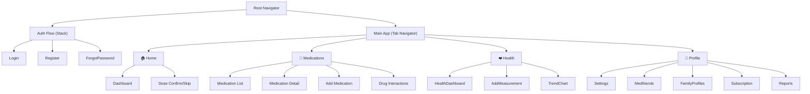
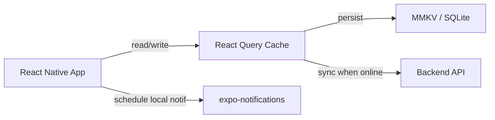

# Step 13 – Frontend Foundation & Navigation

## Goals
- Set up React Native with Expo
- Design system (colours, typography, components)
- Navigation structure
- State management
- Offline-first architecture

---

## 1. Expo Project Setup

```bash
npx -y create-expo-app@latest apps/mobile --template blank-typescript
```

### Key Dependencies
| Package | Purpose |
|---|---|
| `expo-notifications` | Local + push notifications |
| `expo-camera` | Prescription label scanning |
| `expo-image-picker` | Medication photo upload |
| `expo-secure-store` | Secure token storage |
| `expo-calendar` | Appointment calendar sync |
| `expo-local-authentication` | Biometric auth |
| `@react-navigation/native` | Navigation framework |
| `@react-navigation/bottom-tabs` | Tab navigation |
| `@react-navigation/native-stack` | Stack navigation |
| `@tanstack/react-query` | Server state management |
| `zustand` | Client state management |
| `react-native-reanimated` | Animations |
| `react-native-chart-kit` | Health data charts |
| `@gorhom/bottom-sheet` | Bottom sheets |
| `react-native-mmkv` | Fast local storage |

---

## 2. Design System

### Colour Palette
```typescript
const colors = {
  // Primary
  primary:     '#4F46E5', // Indigo
  primaryLight:'#818CF8',
  primaryDark: '#3730A3',

  // Status
  success:     '#10B981', // Green (taken)
  warning:     '#F59E0B', // Amber (snoozed / moderate)
  danger:      '#EF4444', // Red (missed / severe)
  info:        '#3B82F6', // Blue (info)

  // Neutrals
  background:  '#F8FAFC',
  surface:     '#FFFFFF',
  textPrimary: '#1E293B',
  textSecondary:'#64748B',
  border:      '#E2E8F0',

  // Dark mode
  dark: {
    background:  '#0F172A',
    surface:     '#1E293B',
    textPrimary: '#F1F5F9',
    textSecondary:'#94A3B8',
    border:      '#334155',
  },
};
```

### Typography
```typescript
// Using Inter font family (Google Fonts)
const typography = {
  h1:       { fontSize: 28, fontWeight: '700', lineHeight: 34 },
  h2:       { fontSize: 22, fontWeight: '600', lineHeight: 28 },
  h3:       { fontSize: 18, fontWeight: '600', lineHeight: 24 },
  body:     { fontSize: 16, fontWeight: '400', lineHeight: 22 },
  bodySmall:{ fontSize: 14, fontWeight: '400', lineHeight: 20 },
  caption:  { fontSize: 12, fontWeight: '400', lineHeight: 16 },
  button:   { fontSize: 16, fontWeight: '600', lineHeight: 20 },
};
```

### Shared UI Components
| Component | Description |
|---|---|
| `Button` | Primary, secondary, ghost, danger variants |
| `Card` | Elevated / flat card with optional header |
| `Badge` | Status badges (taken, missed, pending) |
| `Input` | Text, password, date, time inputs |
| `Modal` | Confirmation, alert, bottom sheet modals |
| `ProgressRing` | Circular adherence progress |
| `MedPill` | Visual medication representation (shape + color) |
| `Chart` | Line, bar, pie charts for health data |
| `Avatar` | User/family profile avatars |
| `EmptyState` | Friendly empty state illustrations |
| `SkeletonLoader` | Loading placeholders |

---

## 3. Navigation Structure



---

## 4. State Management

### Server State (@tanstack/react-query)
- All API data (medications, health data, reports) managed via React Query
- Automatic caching, background refetching, optimistic updates
- Offline persistence via `react-query` `persistQueryClient`

### Client State (Zustand)
- UI state: theme, current tab, modals
- Auth state: tokens, current user
- Notification permissions state

```typescript
// stores/authStore.ts
interface AuthState {
  user: User | null;
  accessToken: string | null;
  isAuthenticated: boolean;
  login: (email: string, password: string) => Promise<void>;
  logout: () => void;
  refreshToken: () => Promise<void>;
}
```

---

## 5. Offline-First Architecture



- Use `react-query`'s `onlineManager` to pause/resume mutations
- Queue mutations when offline, replay when connectivity returns
- Local notifications scheduled independently of server

---

## 6. Web Dashboard Setup

```bash
npx -y create-vite@latest apps/web -- --template react-ts
```

- React + Vite + TypeScript
- Shared types from `packages/shared-types`
- Shadcn/ui (or Radix UI) for component library
- Recharts for data visualisation
- React Router for navigation

---

> **Next →** [Step 14 – Frontend Feature Screens](./14-frontend-screens.md)
