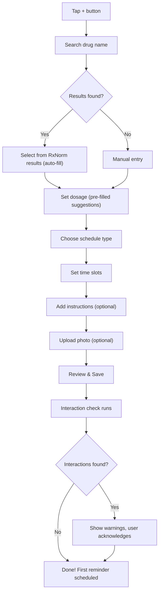

# Step 14 – Frontend Feature Screens

## Goals
- Define all screens with UX flow descriptions
- Accessibility considerations
- Animation & micro-interaction specs

---

## 1. Screen Inventory

### Auth Screens
| Screen | Key Elements |
|---|---|
| **Welcome** | App logo, tagline, "Get Started" / "I have an account" |
| **Register** | Name, email, password, terms checkbox, social login buttons |
| **Login** | Email, password, "Forgot password?", biometric button, social login |
| **Forgot Password** | Email input → confirmation message |
| **Email Verification** | Code input or deep link confirmation |

### Home / Dashboard
| Screen | Key Elements |
|---|---|
| **Dashboard** | Greeting, streak, today's schedule, weekly adherence bar, alerts, health snapshot, AI insight card |
| **Dose Action Sheet** | Bottom sheet: "Take", "Skip", "Snooze 15 min", medication details |

### Medication Screens
| Screen | Key Elements |
|---|---|
| **Medication List** | Filterable list (active/inactive), FAB to add, search bar |
| **Medication Detail** | Photo, name, dosage, schedule, instructions, adherence history, interaction warnings, refill status |
| **Add/Edit Medication** | Multi-step form: Name search → Dosage → Schedule → Photo → Review |
| **Schedule Builder** | Visual schedule picker (daily, specific days, interval, cycle) with time slots |
| **Drug Interactions** | List of detected interactions with severity badges, tap for detail |

### Health Screens
| Screen | Key Elements |
|---|---|
| **Health Dashboard** | Grid of metric cards with latest values, tap to chart |
| **Add Measurement** | Metric picker → value input → date/time → notes |
| **Trend Chart** | Line chart with period selector (7d / 30d / 90d / 1y), min/max/avg stats |

### Medfriend Screens
| Screen | Key Elements |
|---|---|
| **Medfriends List** | Linked caregivers/patients, invite button |
| **Invite Medfriend** | Email input, permission checkboxes, send invite |
| **Caregiver View** | Patient's med list + adherence (read-only or editable per permissions) |

### Profile & Settings
| Screen | Key Elements |
|---|---|
| **Profile** | Avatar, name, email, timezone, edit button |
| **Family Profiles** | List of dependents, add/edit/remove |
| **Settings** | Notifications, weekend mode, theme, language, biometric toggle |
| **Subscription** | Current plan, upgrade CTA, plan comparison |
| **Reports** | Period picker → view/download PDF |

### AI Chatbot
| Screen | Key Elements |
|---|---|
| **Chatbot** | Chat bubble interface, medication context shown, disclaimer banner |

### Pharmacy
| Screen | Key Elements |
|---|---|
| **Pharmacy Locator** | Map + list view, filters |
| **Refill Request** | Select medication, pharmacy, confirm |
| **Scan Prescription** | Camera view → OCR results → confirm extracted data |

---

## 2. UX Flow: Adding a Medication



---

## 3. Animations & Micro-Interactions

| Interaction | Animation |
|---|---|
| Dose confirmed | Checkmark + confetti burst (Lottie) |
| Streak milestone (7, 30, 100 days) | Celebration modal with animation |
| Switching tabs | Smooth cross-fade |
| Pulling to refresh | Custom branded pull indicator |
| Drug interaction alert | Shake + red pulse |
| Health measurement logged | Value animate-in from input |
| Bottom sheet | Spring-based gesture-driven |
| Skeleton loading | Shimmer effect |

### Libraries
- `react-native-reanimated` for gesture and layout animations
- `lottie-react-native` for complex animations (confetti, celebrations)
- `moti` for declarative animations

---

## 4. Accessibility

| Requirement | Implementation |
|---|---|
| Screen reader support | All interactive elements have `accessibilityLabel` and `accessibilityHint` |
| Font scaling | Support system font size up to 200% |
| Colour contrast | WCAG AA minimum (4.5:1 for text) |
| Haptic feedback | Light haptics on dose confirm, error haptics on warnings |
| Reduce motion | Respect system "Reduce Motion" setting, disable animations |
| Large touch targets | Minimum 44×44 points for all tappable elements |
| Voice-over navigation | Logical focus order, grouped elements |

---

## 5. Multi-Language Support

- Use `i18next` + `react-i18next` for internationalisation
- Initial languages: English, Spanish
- RTL layout support for future Arabic/Hebrew

```typescript
// i18n/en.json
{
  "home": {
    "greeting": "Good {{timeOfDay}}, {{name}}!",
    "streak": "Adherence streak: 🔥 {{days}} days"
  }
}
```

---

> **Next →** [Step 15 – Premium & Payments](./15-premium-payments.md)
