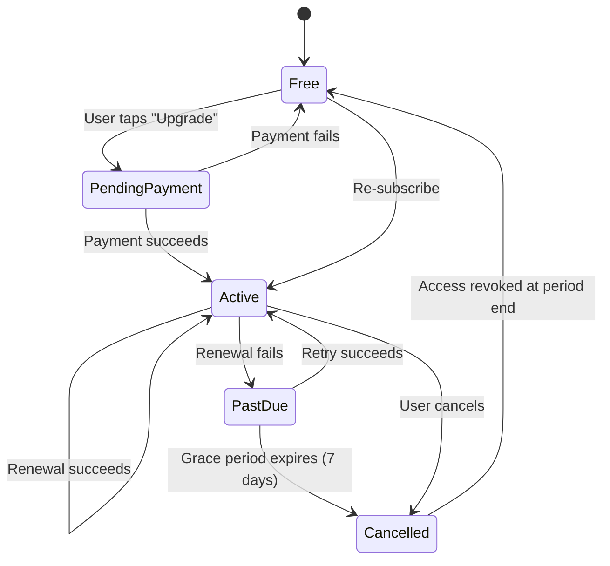

# Step 15 – Premium Tier & Payments

## Goals
- Implement freemium model with feature gating
- In-app purchases (iOS/Android) and Stripe for web
- Subscription lifecycle management

---

## 1. Plans

| Plan | Price | Features |
|---|---|---|
| **Free** | $0 | 10 medications, 1 Medfriend, 1 family profile, 3 health metrics, 30-day history, basic reports |
| **Premium Monthly** | $4.99/mo | Unlimited everything, AI features, health sync, advanced reports, no ads, priority support |
| **Premium Yearly** | $39.99/yr | Same as monthly (save ~33%) |

---

## 2. Feature Gate Middleware

```typescript
// middleware/premiumGate.middleware.ts
export function requirePremium(feature: PremiumFeature) {
  return (req: AuthenticatedRequest, res: Response, next: NextFunction) => {
    if (!req.user.isPremium && PREMIUM_FEATURES.includes(feature)) {
      throw new ForbiddenError('This feature requires a Premium subscription');
    }
    next();
  };
}

// Usage:
router.post('/ai/chatbot/ask', authMiddleware, requirePremium('ai_chatbot'), chatbotController.ask);
```

### Feature Flags (stored in `plans.features` JSONB)
```json
{
  "maxMedications": 10,
  "maxMedfriends": 1,
  "maxFamilyProfiles": 1,
  "maxHealthMetrics": 3,
  "historyDays": 30,
  "aiFeatures": false,
  "healthSync": false,
  "advancedReports": false,
  "adFree": false,
  "providerPortal": false
}
```

---

## 3. Payment Providers

### Mobile: In-App Purchases
- Use `react-native-iap` or `expo-in-app-purchases`
- iOS: App Store Connect subscriptions
- Android: Google Play Billing
- Server-side receipt validation (critical for security)

### Web: Stripe
- Stripe Checkout for subscription creation
- Stripe Customer Portal for management
- Webhook handler for subscription events

### Backend Webhook Handler
```typescript
// POST /webhooks/stripe
app.post('/webhooks/stripe', express.raw({ type: 'application/json' }), async (req, res) => {
  const event = stripe.webhooks.constructEvent(req.body, sig, webhookSecret);

  switch (event.type) {
    case 'customer.subscription.created':
    case 'customer.subscription.updated':
      await subscriptionService.syncFromStripe(event.data.object);
      break;
    case 'customer.subscription.deleted':
      await subscriptionService.cancel(event.data.object);
      break;
    case 'invoice.payment_failed':
      await subscriptionService.handlePaymentFailure(event.data.object);
      break;
  }
  res.json({ received: true });
});
```

---

## 4. Subscription Lifecycle



---

## 5. Grace Period & Downgrade

When a premium subscription expires:
1. **Immediate**: Features still accessible until `current_period_end`
2. **Period end**: Downgrade to free tier
3. **Downgrade logic**:
   - Medications beyond limit 10 → marked inactive (not deleted)
   - Medfriends beyond limit 1 → permissions suspended (not removed)
   - Health metric tracking → limited to most recent 3
   - Data is **never deleted** — just hidden behind premium gate

---

> **Next →** [Step 16 – Security & Testing](./16-security-testing.md)
